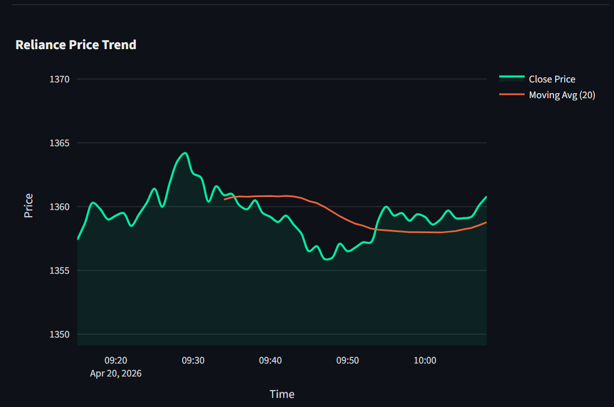
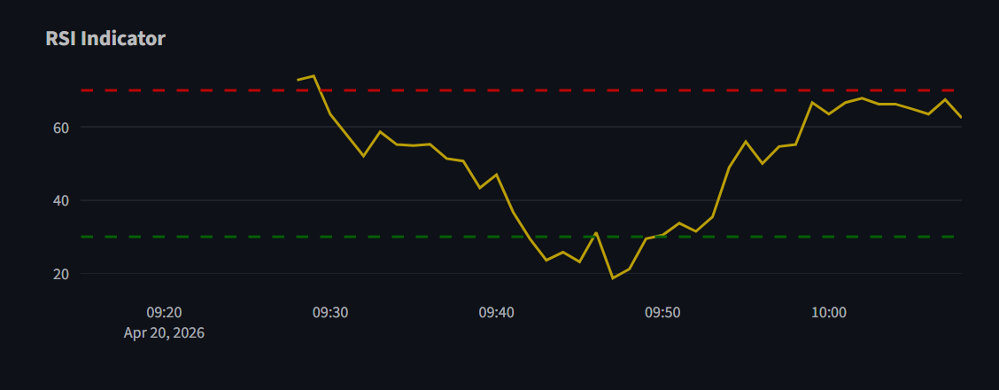

📊 Real-Time Stock Analysis Dashboard with RSI & Moving Average

🚀 Project Overview
This project is an interactive Stock Market Dashboard built using Streamlit. It allows users to visualize stock price trends, analyze technical indicators, and compare multiple stocks in real-time.
The dashboard focuses on key indicators like Moving Average (MA) and Relative Strength Index (RSI) to help understand market behavior.

🎯 Features
Real-time stock data using Yahoo Finance
Auto-refreshing dashboard
Interactive price charts using Plotly
RSI Indicator for momentum analysis
Moving Average (MA) for trend analysis
Display of recent stock data
Compare multiple stocks
User-friendly sidebar controls

🛠️ Technologies Used
Python
Streamlit
yFinance
Plotly

📂 Project Structure
stock-dashboard/
│── dash.py
│── README.md
│── requirements.txt

⚙️ Installation & Setup
1. Clone the repository
git clone https://github.com/Jananikamma20/Stock-Dashboard.git
cd stock-dashboard
2. Install dependencies
pip install -r requirements.txt
3. Run the app
streamlit run dash.py

📊 Indicators Used
🔹 Moving Average (MA)
Calculates average price over 20 periods
Helps identify trend direction
🔹 RSI (Relative Strength Index)
RSI > 70 → Overbought condition
RSI < 30 → Oversold condition
Used to understand momentum

📸 Screenshots
Dashboard View

RSI Indicator

💡 Limitations
No automated buy/sell signals
No volume analysis
Indicators are for visualization only (not trading advice)

🚀 Future Improvements
Add buy/sell signal generation
Include volume analysis
Add more indicators (MACD, Bollinger Bands)
Deploy as a web app

📌 Use Cases
Learning stock analysis
Understanding technical indicators
Data visualization practice

👨‍💻 Author
Kamma Janani
